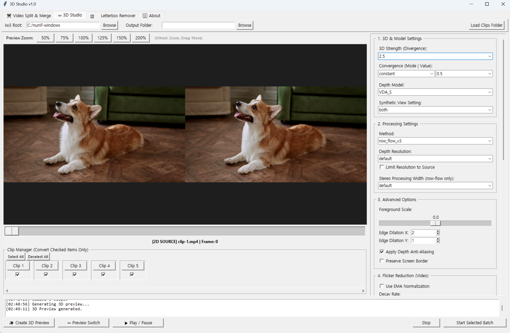

__🎥 3D Studio__ 

3D Studio is an all-in-one workflow tool designed to convert standard videos into high-quality 3D content. 
It automates the complex process of decomposing videos, converting them to 3D, and merging them back together, making professional-grade 3D video creation accessible to everyone. 

__✨ Key Features__ 

Video Split & Merge (VSM): Precisely splits videos by scene and merges them back after conversion. 
3D Conversion (IW3S): Provides high-performance 3D conversion and advanced configuration powered by the iw3 engine. 
Smart Cropping: Maximizes conversion efficiency through letterbox removal and custom cropping. 
Batch Processing: Manages complex, multi-step conversion workflows within a single, intuitive GUI. 

__⚙️ Requirements__ 

This program is a freeware GUI tool and does not include the core execution engines. For the software to function correctly, you must independently prepare the following external tools: 

FFmpeg: For video splitting and merging. - https://www.ffmpeg.org/download.html 
(ffmpeg-git-essentials.7z or ffmpeg-git-full.7z) 
PySceneDetect: For scene change detection. - https://github.com/Breakthrough/PySceneDetect/releases 
(PySceneDetect-0.6.7-win64.zip) 
IW3 (nunif): The core 3D conversion engine. - https://github.com/nagadomi/nunif/releases/tag/0.0.0 
(nunif-windows.zip) 
Note: After launching the program, you must specify the paths for these tools in the Settings tab. 

__🚀 Installation & Setup__ 

Download the latest .exe file from the Releases page. 
Launch the program and configure the external tool paths in the Settings: 
Video Split & Merge Tab: Set the path to ffmpeg.exe under System Path Settings. 
(Note: ffprobe.exe must be located in the same folder as ffmpeg.exe). 
Set the path to scenedetect.exe (Recommended version: PySceneDetect-0.6.7-win64). 
3D Studio Tab: Set the iw3 Root to the top-level nunif-windows folder (where the install.bat, iw3-gui.bat, setenv.bat... file is located). 
(Note: Please note that IW3 must be installed using the install.bat file beforehand.) 

__📖 How to Use__ 

Video Split: In the Video Split tab, load your video and split it into scenes. 
The number of clips generated will vary based on your Threshold and Min Length settings. 
Load Clips: Move to the 3D Studio tab and click the Load Clips Folder button to import all split clips. 
3D Conversion: Only checked clips in the list will be converted. 
The 3D options are identical to iw3. 
To avoid errors during the final merge, ensure all clips use the same video encoding options. 
Video Merge: Once all clips are converted to 3D, go to the Video Merge tab. 
Specify the folder containing the converted clips, select the original video for the audio source, and click the Merge button to generate the final 3D video. 

__⌨️ Keyboard Shortcuts Action__  

Move frame backward/forward: Ctrl + ← / → 
Navigate between clips: Alt + ← / → 
Select all clips: Alt + A 
Deselect all clips: Alt + D 
Select/Deselect single clip: Alt + S 
Create 3D Preview: Alt + Z 
Toggle 2D/3D Preview mode: Alt + X 
Play/Pause video: Alt + C 
Start video conversion: Alt + B 

__⚖️ License & Terms__ 

This program is a free software created by an individual developer. 
It is available for personal and non-commercial use only. 
Resale, paid distribution, or use in commercial services is strictly prohibited. 
Disclaimer: This program is provided "as is" without any warranty. 
The developer shall not be held liable for any issues, data loss, or system errors resulting from the use of this software. 
3D Studio utilizes engines from FFmpeg, PySceneDetect, and IW3. All copyrights and licenses for these tools belong to their respective developers. 
